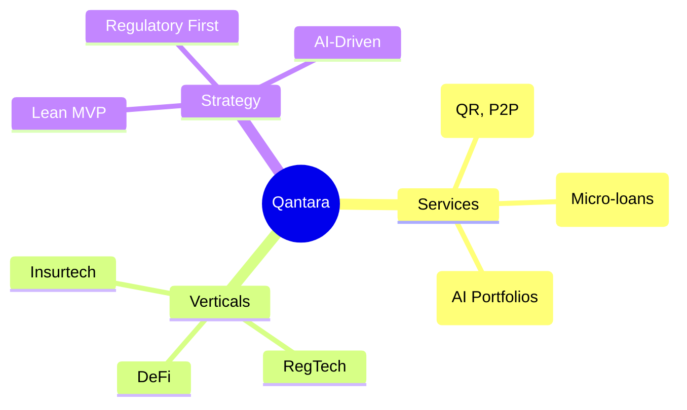

# 🌉 Qantara — Full-Stack Fintech SaaS Strategy & Analysis

## 1. Executive Summary
**Qantara** (Arabic for "Bridge") is a premium, full-stack fintech platform designed to bridge the financial inclusion gap in Morocco and scale across the Pan-African and European markets. It combines high-fidelity digital banking experiences with a multi-model AI advisor ecosystem.

| Attribute | Details |
|-----------|---------|
| **Brand Name** | **Qantara** |
| **Identity** | High-tech, minimalist bridge/Q icon with deep blue, teal, and gold aesthetics. |
| **Core Mission** | Redefining financial intelligence through accessible, AI-driven banking. |
| **Founder Model** | Solo-founder, lean operations, API-first architecture. |
| **Location** | Headquarters in Morocco (aligning with Morocco Fintech Center). |

---

## 2. Market Analysis (Morocco & Beyond)

### 📊 The Opportunity
- **Unbanked Potential**: 15 million Moroccans (~56% of adults) remain unbanked.
- **Mobile First**: 137.5% mobile penetration and ~83% internet access.
- **Remittance Flow**: $10B+ annual diaspora remittances (top corridor for innovation).
- **Insurtech/WealthTech Gap**: Significant underserved segments in micro-insurance and automated wealth management.

### ⚖️ Regulatory Landscape
- **Bank Al-Maghrib**: Primary regulator for payment & credit licenses.
- **CNDP Compliance**: Strict data residency and protection (Law 09-08 / GDPR aligned).
- **Law 43-20**: Enabling digital trust and e-signatures.

---

## 3. Product Roadmap & Strategy

1. **Phase 1: Proof of Concept (Current)**
   - Build high-fidelity landing and dashboard.
   - Integrate local LLMs for financial advisory.
   - Pilot with freelance/SME segment.
2. **Phase 2: Local Scaling**
   - Secure Moroccan payment aggregator licenses.
   - Integrate with local banking APIs (API-Aggregation).
3. **Phase 3: North Africa Expansion**
   - Target Francophone West Africa (Ivory Coast, Senegal).
4. **Phase 4: European Entry**
   - Establish EU entity for diaspora remittance and investment.
5. **Phase 5: Global Fintech Infrastructure**
   - Transition to a B2B API platform (Banking-as-a-Service).

---

## 4. Platform Architecture

### 🏗️ Technical Stack
- **Frontend**: Next.js 15 (App Router), Framer Motion, Lucide React.
- **Backend**: Node.js + Express (High-performance REST API).
- **Database**: PostgreSQL with Prisma ORM (Scalable relational data).
- **AI Infrastructure**: Ollama (Local/Self-hosted multi-model hosting).
- **Authentication**: JWT with secure cookie-based session management.

### 🧠 Multi-Model AI Ecosystem
Qantara uses a specialized "Router" approach to assign specific financial tasks to the best-fit model:

| Model | Role | Functional Assignment |
|-------|------|-----------------------|
| `qwen3.5:cloud` | **Primary Advisor** | Holistic financial planning & complex advisory. |
| `deepseek-r1:8b` | **Reasoning Engine** | Risk assessment, credit scoring, and logic-heavy analysis. |
| `qwen3.5:9b` | **General Support** | Onboarding, FAQ, and customer interaction. |
| `gemma:7b` | **Market Analyst** | Sentiment analysis and market trend tracking. |
| `gemma4:E4B` | **Security/Fraud** | Anomaly detection and transaction verification. |
| `gemma4:E2B` | **Quick Processor** | Transaction categorization and quick summaries. |

---

## 5. Data Model & Strategy Mindmap

### 🗺️ Business Flow Strategy

### 🗄️ Database Structure
- **User**: Profile, Auth, Roles.
- **Account**: Savings, Checking, Multi-currency (MAD/EUR).
- **Transaction**: Full ledger with AI-categorization.
- **Loan**: Terms, interest, and AI-scored approvals.
- **Investment**: Real-time asset tracking.
- **ChatMessage**: Persistent AI conversation history with model tagging.

---

## 6. Implementation Status

- [x] **Project Scaffolding**: Next.js client + Node.js server.
- [x] **Branding**: Renamed to Qantara, new sleek logo & favicon created.
- [x] **Authentication**: JWT Login/Register fully functional.
- [x] **Dashboard Overview**: Financial KPIs and transaction feeds implemented.
- [x] **AI Advisor Interface**: Chat system with model routing implemented.
- [x] **Diagnostics**: All syntax and spelling errors resolved.
- [ ] **Payments Module**: Integration with payment gateways (Phase 2).
- [ ] **Lending Flow**: Finalizing AI risk scoring integration (Phase 2).

---

## 7. Operational Instructions

### Running the Platform Locally
1. **Server**: `cd server && node index.js` (Requires Postgres & Ollama).
2. **Client**: `cd client && npm run dev` (Access via `localhost:3000`).

---
**Qantara — Bridge the Gap to Financial Intelligence.**
