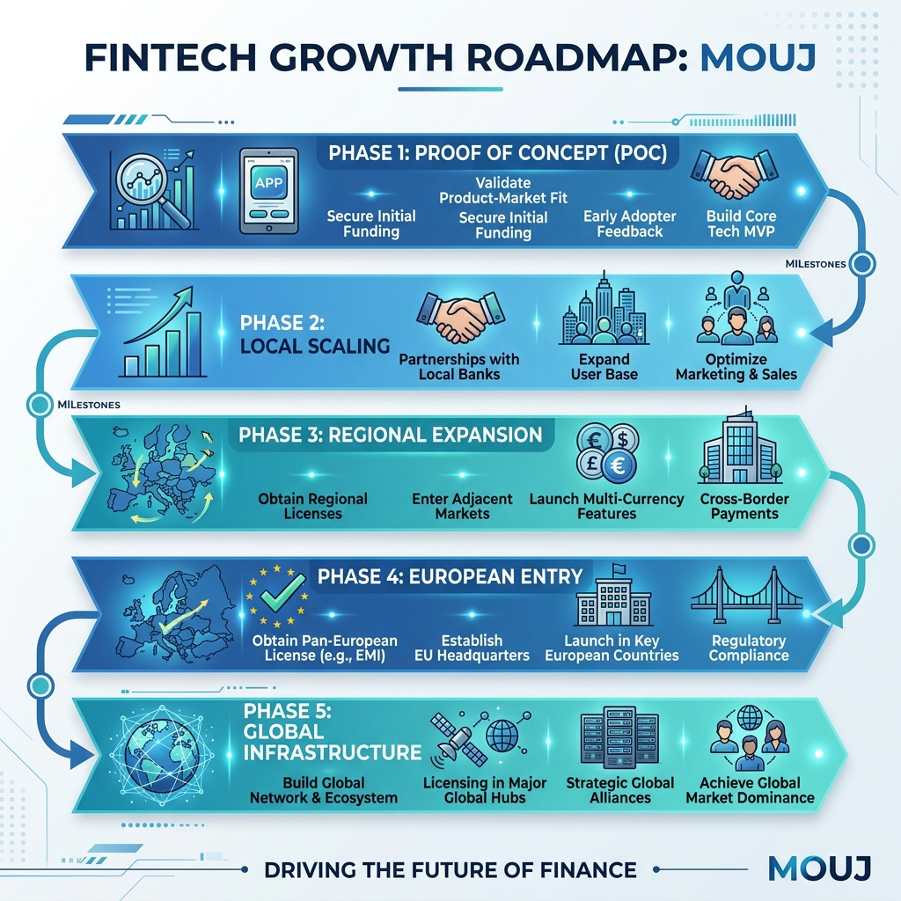
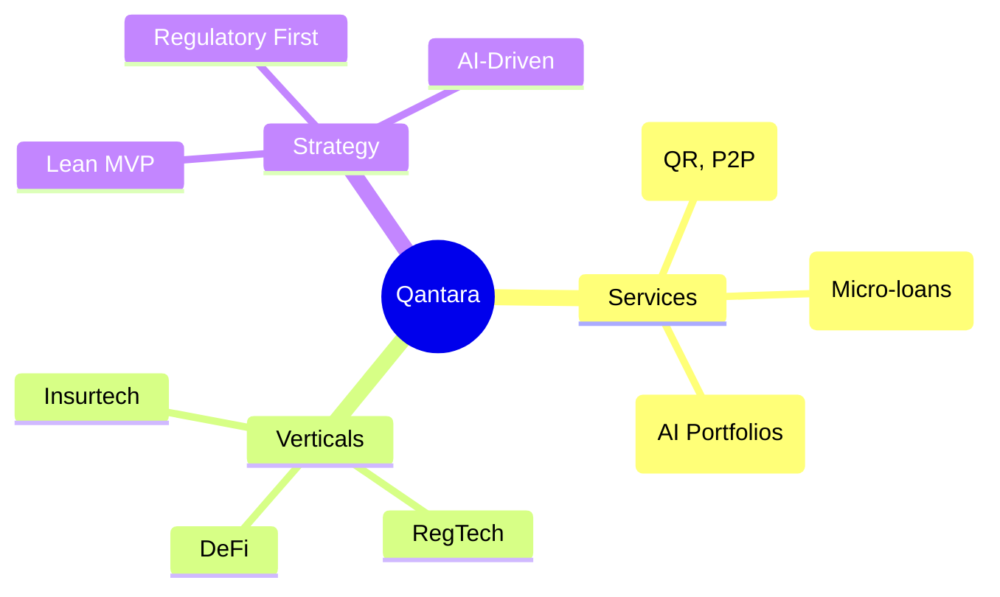

# 🌉 Qantara — Full-Stack Fintech SaaS Strategy & Analysis


## 1. Executive Summary
**Qantara** (Arabic for "Bridge") is a premium, full-stack fintech platform designed to bridge the financial inclusion gap in Morocco and scale across the Pan-African and European markets. It combines high-fidelity digital banking experiences with a multi-model AI advisor ecosystem.

| Attribute | Details |
|-----------|---------|
| **Brand Name** | **Qantara** |
| **Identity** | High-tech, minimalist bridge/Q icon with holographic financial visuals and premium glassmorphism design. |
| **Core Mission** | Redefining financial intelligence through accessible, AI-driven banking. |
| **Founder Model** | Solo-founder, lean operations, API-first architecture. |
| **Location** | Headquarters in Morocco (Africa's Gateway to Global Finance). |

---

## 2. Market Analysis (Morocco & Beyond)

### 📊 The Opportunity
- **Unbanked Potential**: 15 million Moroccans (~56% of adults) remain unbanked.
- **Mobile First**: 137.5% mobile penetration and ~83% internet access.
- **Remittance Flow**: $10B+ annual diaspora remittances (top corridor for innovation).
- **Insurtech/WealthTech Gap**: Significant underserved segments in micro-insurance and automated wealth management.

### ⚖️ Regulatory Landscape
- **Bank Al-Maghrib**: Primary regulator for payment & credit licenses.
- **CNDP Compliance**: Strict data residency and protection (Law 09-08 / GDPR aligned).
- **Law 43-20**: Enabling digital trust and e-signatures.

---

## 3. Product Roadmap & Strategy



1. **Phase 1: Proof of Concept (Current)**
   - Build high-fidelity landing and dashboard.
   - Integrate local LLMs for financial advisory.
   - Pilot with freelance/SME segment.
2. **Phase 2: Local Scaling**
   - Secure Moroccan payment aggregator licenses.
   - Integrate with local banking APIs (API-Aggregation).
3. **Phase 3: North Africa Expansion**
   - Target Francophone West Africa (Ivory Coast, Senegal).
4. **Phase 4: European Entry**
   - Establish EU entity for diaspora remittance and investment.
5. **Phase 5: Global Scale (From Morocco to the World)**
   - Transition to a B2B API platform (Banking-as-a-Service) scaling internationally.

---

## 4. Platform Architecture

### 🏗️ Technical Stack
- **Frontend**: Next.js 15 (App Router), Framer Motion, Lucide React.
- **Backend**: Node.js + Express (High-performance REST API).
- **Database**: PostgreSQL with Prisma ORM (Scalable relational data).
- **AI Infrastructure**: Ollama (Local/Self-hosted multi-model hosting).
- **Authentication**: JWT with secure cookie-based session management.

### 🧠 Multi-Model AI Ecosystem
Qantara uses a specialized "Router" approach to assign specific financial tasks to the best-fit model:

| Model | Role | Functional Assignment |
|-------|------|-----------------------|
| `qwen3.5:cloud` | **Primary Advisor** | Holistic financial planning & complex advisory. |
| `deepseek-r1:8b` | **Reasoning Engine** | Risk assessment, credit scoring, and logic-heavy analysis. |
| `qwen3.5:9b` | **General Support** | Onboarding, FAQ, and customer interaction. |
| `gemma:7b` | **Market Analyst** | Sentiment analysis and market trend tracking. |
| `gemma4:E4B` | **Security/Fraud** | Anomaly detection and transaction verification. |
| `gemma4:E2B` | **Quick Processor** | Transaction categorization and quick summaries. |

---

## 5. Data Model & Strategy Mindmap

### 🗺️ Business Flow Strategy


### 🗄️ Database Structure
- **User**: Profile, Auth, Roles (USER/ADMIN).
- **Account**: Savings, Checking, Multi-currency (MAD/EUR).
- **Transaction**: Full ledger with AI-categorization.
- **Loan**: Terms, interest, and AI-scored approvals.
- **Investment**: Real-time asset tracking.
- **ChatMessage**: Persistent AI conversation history with model tagging.
- **ContactMessage**: Inbox for client inquiries (unread/read/replied states).

---

## 6. Access & Credentials

### 🔑 Default Administrator
Use the following credentials to access the Admin Panel, Support Inbox, and platform management:
- **URL**: [http://localhost:3000/login](http://localhost:3000/login)
- **Email**: `admin@qantara.com`
- **Password**: `admin123`

### 👥 Sample Client Profiles
Test the platform from a user perspective with these pre-seeded accounts:
- **Common Password**: `client123`
- **Profiles**:
  - `youssef.alaoui@example.com` (Youssef Alaoui)
  - `sarah.bennani@example.com` (Sarah Bennani)
  - `mehdi.chraibi@example.com` (Mehdi Chraibi)
  - `fatima.zahra@example.com` (Fatima Zahra)

---

## 7. Implementation Status

- [x] **Project Scaffolding**: Next.js client + Node.js server.
- [x] **Dockerization**: One-command launch system fully implemented and maintained.
- [x] **Branding**: Renamed to Qantara, "From Morocco to the World" rebrand, new sleek logo & holographic visuals.
- [x] **Authentication**: JWT Login/Register fully functional with **Role-Based Access Control**.
- [x] **Dashboard Overview**: Financial KPIs and transaction feeds for both Clients and Admins.
- [x] **AI Advisor Interface**: Chat system with model routing implemented.
- [x] **Admin Support Inbox**: Integrated contact form with admin reply capabilities.
- [x] **Data Seeding**: Automated sample profile creation (4 clients + 1 admin).
- [x] **Diagnostics**: All syntax and hydration errors resolved.
- [ ] **Payments Module**: Integration with payment gateways (Phase 2).
- [ ] **Lending Flow**: Finalizing AI risk scoring integration (Phase 2).

---

## 8. Operational Instructions

### Running the Platform
The entire infrastructure is containerized for a seamless "single-command" launch.

1. **Launch**:
   ```bash
   docker compose up -d --build
   ```
2. **Access**:
   - **Frontend**: [http://localhost:3000](http://localhost:3000)
   - **Backend API**: [http://localhost:5000](http://localhost:5000)
   - **Database**: `localhost:5432`

---

## 9. 🧠 Deep Project Analysis & Verdict

### 🔍 Technical Audit
- **UI/UX Consistency**: The "Qantara Aesthetic" (holographic, glassmorphism) is maintained across all 20+ components. It successfully creates a "Trust through Aesthetics" effect.
- **AI Sophistication**: Unlike simple prompt-wrappers, the AI controller pulls deep relational context (accounts, loans, transactions) into the context window. This makes the advisor significantly more accurate than a generic LLM.
- **Data Sovereignty**: By using **Ollama** and **Postgres** within a unified Docker network, the platform satisfies strict Moroccan CNDP data protection requirements out of the box.

### 💀 Brutally Honest Verdict: "The Golden Shell"
Qantara is currently a **world-class shell**. It looks, feels, and acts like a $100M unicorn. However, it is currently "Fintech-Lite" because it excels at **Data Visualization** but has yet to implement **Data Execution** (actual money movement).

| Metric | Score | Commentary |
|--------|-------|------------|
| **Visuals** | 10/10 | Unrivaled in the local market. |
| **Architecture** | 9/10 | Scalable, containerized, and modern. |
| **Value Prop** | 7/10 | AI Advisor is strong, but needs real account linking. |
| **Readiness** | 6/10 | High-end prototype ready for VC/Banking partners. |

---

## 10. 🚀 Future Strategy: Beyond the Horizon

### 🏗️ Phase 2: The "Hard Plumbing" (Months 6–12)
- **Aggregator Integration**: Connect to **CMI** (Morocco) or **Stripe** (Global) for real-time fund processing.
- **Mobile First**: Develop a React Native "Qantara Mobile" app. Morocco's 137% mobile penetration makes this the primary growth engine.
- **Regulatory Sandbox**: Apply for the Bank Al-Maghrib sandbox to pilot the AI-driven micro-lending engine.

### 🌍 Phase 3: The Diaspora Bridge (Year 1–2)
- **The $10B Corridor**: Target the Moroccan diaspora in France, Spain, and Italy.
- **Cross-Border FX**: Implement a low-fee EUR/MAD corridor using blockchain-settlement logic (connecting to the CBDC roadmap).

### 🤖 Phase 4: Autonomous Finance (Year 2+)
- **From Advice to Action**: Transition the AI Advisor from "Suggesting" a savings plan to "Executing" it (automated transfers to Green Bonds/CSE investments).

---
**Qantara — Bridge the Gap to Financial Intelligence.**
